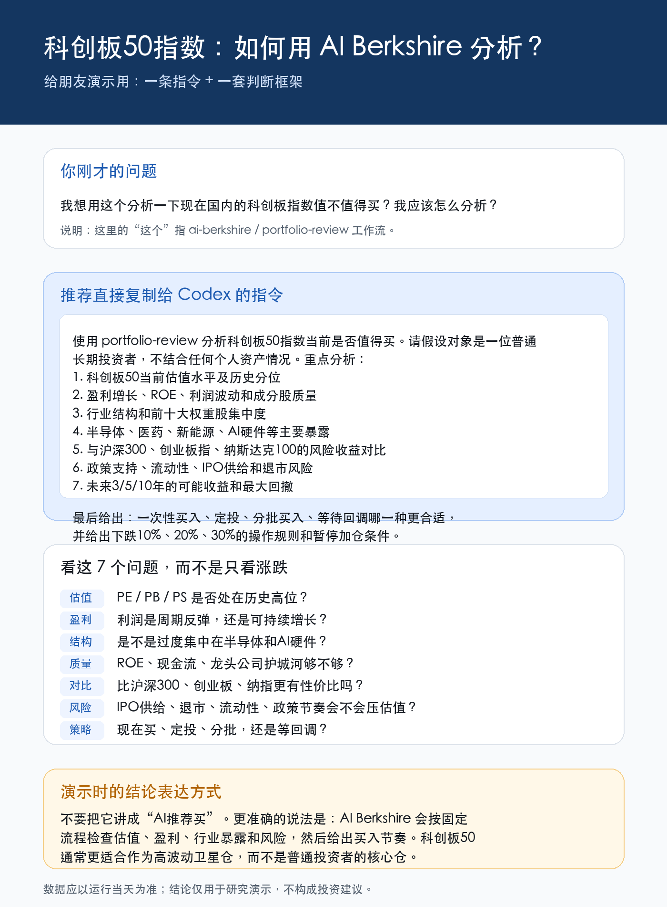

## 原始问题

我想用这个分析一下现在国内的科创板指数值不值得买？我应该怎么分析？

这里的“这个”指 `ai-berkshire` 里的 `portfolio-review` 工作流。

## 推荐指令

```text
使用 portfolio-review 分析科创板50指数当前是否值得买。请假设对象是一位普通长期投资者，不结合任何个人资产情况。重点分析：
1. 科创板50当前估值水平及历史分位
2. 盈利增长、ROE、利润波动和成分股质量
3. 行业结构和前十大权重股集中度
4. 半导体、医药、新能源、AI硬件等主要暴露
5. 与沪深300、创业板指、纳斯达克100的风险收益对比
6. 政策支持、流动性、IPO供给和退市风险
7. 未来3/5/10年的可能收益和最大回撤

最后给出：
- 当前是否适合一次性买入
- 是否更适合定投
- 分批买入规则
- 下跌10%、20%、30%时如何处理
- 哪些条件出现时应该暂停加仓
```

## 分析框架

分析指数不要只看最近涨跌，至少看七个问题：

| 问题 | 重点 |
|---|---|
| 估值 | PE、PB、PS 是否处在历史高位 |
| 盈利 | 利润是周期反弹，还是可持续增长 |
| 结构 | 是否过度集中在半导体、AI硬件等行业 |
| 质量 | ROE、现金流、龙头公司护城河是否足够 |
| 对比 | 与沪深300、创业板指、纳斯达克100相比是否有性价比 |
| 风险 | IPO供给、退市、流动性、政策节奏是否会压估值 |
| 策略 | 现在买、定投、分批，还是等待回调 |

## 演示时的表达

不要把它讲成“AI推荐买”。更准确的说法是：

> AI Berkshire 会按固定流程检查估值、盈利、行业暴露和风险，然后给出买入节奏。

科创板50通常更适合作为高波动卫星仓，而不是普通投资者的核心仓。

## 分享图



## 免责声明

本文仅用于演示 AI 投研工作流，不构成投资建议。所有估值和市场数据应以运行当天的公开数据为准。

